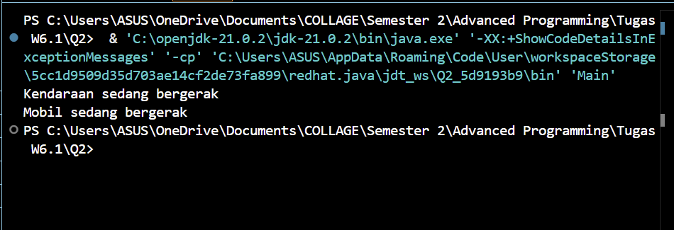

Metode yang di panggil ialah v1.move untuk memanggil metode vehicle dan v2.move untuk memanggil metode Car, yang membedakan kedua baris tersebut ialah objek v1 diisi oleh objek vehicle dan v2 diisi oleh objek Car  